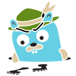

<h1 align="center">
  
</h1>

  

  
  
  
  

#  About Me

I'm a Backend developer from Russia.

I'm interested in Backend development and Machine Learning.

# 📚 My Stack

<!-- 
 -->

<b><h2 align="center">⚡ Favorite Stack</h2></b>

 

<table align="center">
  <tr>
    <td align="center" width="120">
      <a>
        
         <b>Golang</b>
      </a>
    </td>
    <td align="center" width="120">
      <a>
        
         <b>PostgreSQL</b>
      </a>
    </td>
    <td align="center" width="120">
      <a>
        
         <b>Redis</b>
      </a>
    </td>
    <td align="center" width="120">
      <a>
        
         <b>Kafka</b>
      </a>
    </td>
    <td align="center" width="120">
      <a>
        
         <b>Docker</b>
      </a>
    </td>
    <td align="center" width="120">
      <a>
        
         <b>Kubernetes</b>
      </a>
    </td>
  </tr>
</table>

<!-- 
 -->

<b><h2 align="center">🔧 Backend & DevOps</h2></b>

 

<table align="center">
  <tr>
    <td align="center" width="120">
      <a>
        
         <b>Elasticsearch</b>
      </a>
    </td>
    <td align="center" width="120">
      <a>
        
         <b>Jenkins</b>
      </a>
    </td>
    <td align="center" width="120">
      <a>
        
         <b>Grafana</b>
      </a>
    </td>
    <td align="center" width="120">
      <a>
        
         <b>Prometheus</b>
      </a>
    </td>
    <td align="center" width="120">
      <a>
        
         <b>RabbitMQ</b>
      </a>
    </td>
    <td align="center" width="120">
      <a>
        
         <b>Bash</b>
      </a>
    </td>
  </tr>
</table>

<!-- 
 -->

<b><h2 align="center">🤖 Machine Learning</h2></b>

 

<table align="center">
  <tr>
    <td align="center" width="120">
      <a>
        
         <b>Python</b>
      </a>
    </td>
    <td align="center" width="120">
      <a>
        
         <b>Pandas</b>
      </a>
    </td>
    <td align="center" width="120">
      <a>
        
         <b>PyTorch</b>
      </a>
    </td>
    <td align="center" width="120">
      <a>
        
         <b>TensorFlow</b>
      </a>
    </td>
    <td align="center" width="120">
      <a>
        
         <b>Airflow</b>
      </a>
    </td>
    <td align="center" width="120">
      <a>
        
         <b>HuggingFace</b>
      </a>
    </td>
  </tr>
</table>

<!-- 
 -->

<b><h2 align="center">🌐 Other Skills</h2></b>

 

<table align="center">
  <tr>
    <td align="center" width="100">
      <a>
        
         <b>Git</b>
      </a>
    </td>
    <td align="center" width="100">
      <a>
        
         <b>Gitlab</b>
      </a>
    </td>
    <td align="center" width="100">
      <a>
        
         <b>Jira</b>
      </a>
    </td>
    <td align="center" width="100">
      <a>
        
         <b>Jaeger</b>
      </a>
    </td>
    <td align="center" width="100">
      <a>
        
         <b>Postman</b>
      </a>
    </td>
    <td align="center" width="100">
      <a>
        
         <b>Swagger</b>
      </a>
    </td>
  </tr>
</table>

# 📊 GitHub Stats

  

### 📫 Let's Connect!

  
  
   
  
  
  ### ⚡
  *"First, solve the problem. Then, write the code."*

